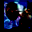
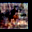

# Cascading Sum Augmentation

This is the official repository for the source code and experiments for Cascading Sum Augmentation [add link to paper]() by Cristian Simionescu, Robert Herscovici and Cosmin Pascaru

The reporsitory contains a PyTorch implementation of our technique and the experiment results contained in TensorBoard log files. Download links for some of the experiment trained weights are also provided. These can be found in the "runs/" folder, each run will contain a README with the command used to obtain the result and the best test accuracy obtained with it.

To run the experiments yourself you will require to install PyTorch>=1.2.0, TorchVision=0.4.0, NumPy>=1.16.3 and tb-nightly==1.15.0a20190825.


Recent advances in Deep Learning have greatly improved performance on various Computer Vision tasks,including classification, object detection and image segmentation. However, training Deep Artificial Neural Networks requires a substantial amount of labeled data, which may prove costly or impractically hard to obtain, especially in certain domains such as robotics or medicine. This makes the search for ways to artificially augment the data we have in order to obtain more generalized models a worthwhile endeavor. One very important argument is that security is extremely relevant in today’s world, and neural networks with superior generalization power not only produce better results, but they are also more resistant to adversarial attacks. Many data augmentation techniques have been proposed, each with various degrees of success and use cases, depending on the data sets, models and machine learning techniques used. They are at theheart of many applications, ranging from image classification to speech recognition. The majority of data augmentation algorithms used result in images that are understandable and can be correctly identified by a human observer e.g. horizontal/vertical flipping, cropping, rotation, brightness adjustments or even random erasing.

Cascading Sum Augmentation is a method to successfully training deep neural networks using linear combinations of arbitarly many inputs achiving a significant gain in test accuracy and an increase in robustness towards adversarial attacks.

The underling technique used is called Sum Augmentation, which creates the overlaped images and associated labels, Cascading Sum Augmentation uses this method as a subroutine. Starting from an example K=8 number of inputs that are combined to generate the augmented data we train our model untill it platoues, then we load the best performing checkpoint we have and restart the training with K=4, repeat untill K=1. When K=1 we are effectively training on the original dataset.

### K=2 images
<p float="left">
  
  
  
  
  
  
  
  
  
  
</p>

### K=4 images
<p float="left">
  
  
  
  
  
  
  
  
  
  
</p>

### K=8 images
<p float="left">
  
  
  
  
  
  
  
  
  
  
</p>

You can see the results of using Cascading Sum Augmentation with various start values for K on CIFAR-10 and CIFAR-100. In the table you can also see the results of our method on subsets of the original datasets. We trained on WideResNet(40,4) and WideResNet(28,10) you will find complete TensorBoard logs for these runs in the "runs" folder.

|          |            |            |           |            |            |           |                 |
| :-------: | :--------: | :--------: | :-------: | :--------: | :--------: | :-------: | :-------------: |
| Starting Sum Groups (K)  | | WideResNet(40,4) | | | WideResNet(28,10) |                 |
|          |    100     |    500     |   5000    |    100     |    500     |   5000    | (Samples/Class) |
| 8        |   31.19%   |   13.51%   |   4.02%   | **29.34%** |   13.21%   |   3.28%   |                 |
| 4        | **30.65%** | **13.29%** | **3.88%** |   30.36%   | **12.81%** | **3.11%** |                 |
| 2        |   32.44%   |   14.88%   |   5.53%   |   30.99%   |   13.1%    |   3.44%   |                 |
| Baseline |   47.36%   |   20.15%   |   5.57%   |   43.47%   |   19.96%   |   4.68%   |                 |
|          |            |            |           |            |            |           |                 |

|          |           |            |            |            |                 |
| :-------: | :-------: | :--------: | :--------: | :--------: | :-------------: |
| Starting Sum Groups (K)  | | WideResNet(40,4) | | WideResNet(28,10) |                 |
|          |    100    |    500     |    100     |    500     | (Samples/Class) |
| 8        |   35.3%   |   20.34%   |   35.01%   |   18.63%   |                 |
| 4        | **34.7%** | **19.85%** | **33.01%** | **18.09%** |                 |
| 2        |  35.56%   |   20.17%   |   34.44%   |   18.17%   |                 |
| Baseline |   43.2%   |   23.87%   |   41.72%   |   21.94%   |                 |
|          |           |            |            |            |                 |

See [add link to article](link to article) for more information and results.


## Test Time Sum Augmentation

This is a method simply applies Sum Augmentation when we want to classify a batch of images. The method generates multiple linear combinations from the data we want tested and does forward passes in the network. Then we calculate the average score for each output in order to calculate the actual label of our data.

The technique drastically improves accuracy for models which had the cascading training method stopped at K=2, meaning the model never saw any "clean" data.
And while the scores are lower than the models which had the final fine-tune step of training on original data, using Test Time Augmentation improves the robustness to adversarial attacks. This method offers a way to make trade-offs between better generalization and robustness.

|       |             |                            |             |                            |
| :---- | :---------: | :------------------------: | :---------: | :------------------------: |
| Values for K  | | WideResNet(40,4) | | WideResNet(28,10) |                 |
|       | Normal Test | Test Time Sum Augmentation | Normal Test | Test Time Sum Augmentation |
| 8-4-2 |    6.53%    |           6.32%            |    5.58%    |           5.11%            |
| 4-2   |    6.91%    |           6.32%            |    5.35%    |         **5.09%**          |
| 2     |    6.19%    |         **6.03%**          |    5.74%    |           5.39%            |
|       |             |                            |             |                            |

|       |             |                            |             |                            |
| :---- | :---------: | :------------------------: | :---------: | :------------------------: |
| Values for K  | | WideResNet(40,4) | | WideResNet(28,10) |                 |
|       | Normal Test | Test Time Sum Augmentation | Normal Test | Test Time Sum Augmentation |
| 8-4-2 |   27.18%    |           24.06%           |   25.11%    |         **20.25%**         |
| 4-2   |   27.22%    |           23.9%            |   24.42%    |           20.46%           |
| 2     |   27.19%    |         **23.58%**         |   24.32%    |           20.29%           |
|       |             |                            |             |                            |

You can use Test Time Augmentation with models which have seen non-interpolated data, you can then use the --aug_test_lambda parameter to adjust the compromise between robustness and generalization performance. 


## Reference

Please use the following bibtex to reference our work:

```
@INPROCEEDINGS{CascadingSumAugmentation,
    author = {Simionescu, Herscovici & Pascaru},
    title = {Cascading Sum Augmentation},
    booktitle = {BMVC},
    year = {2019}}
```

## License

This project is licensed under the Academic Free License (AFL) v. 3.0 - see the \[LICENSE.md\](LICENSE.md) file for details

## Acknowledgments

* Thank you @Dianna22 and Razvan Benchea for the help and interest in our work
* etc
